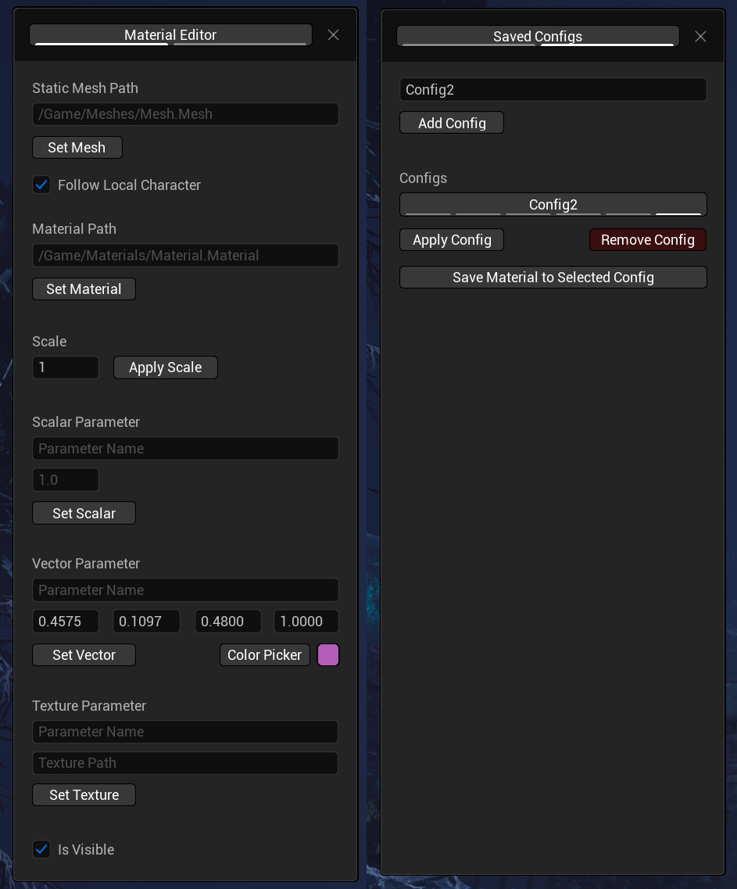

# Material Editor

This mod helps you to experiment with materials in **Dead By Daylight**.

It provides a widget that allows to set mesh, material and parameters. It looks like this:

## Requirements

This mod needs the following modloader: [**ModLoader**](https://drive.google.com/file/d/1fZwSOcxpMJdZBNND8CLDkyMORkjxaWQK/view?usp=sharing)

## Usage

1. Press `Right Ctrl` to open up the **Material Editor** widget
2. Set `Static Mesh Path` and `Material`. You can specify it in FModel package path format (i.e. `DeadByDaylight/Content/Materials/Sky/SM_DBD_SkySphere.uasset`) or Unreal Engine full object name (`/Game/Materials/Sky/SM_DBD_SkySphere.SM_DBD_SkySphere`)
3. Set Scalar, Vector or Texture parameters for specified material.
